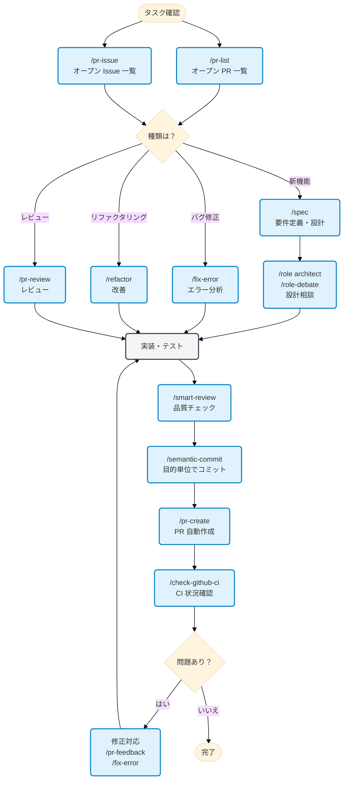

こんにちは、わさびーふです。

今回は Claude Code をより効果的に活用するための設定集「[wasabeef/claude-code-cookbook](https://github.com/wasabeef/claude-code-cookbook)」について紹介しようと思います。

もう冗長な作業をできるだけコマンドに落とし込むようにしています。特に Role 機能で専門家の視点を切り替えられるのが気に入っています。セキュリティとパフォーマンスの専門家に議論させたり、アーキテクトにレビューしてもらったり、議論を俯瞰して見ているような感覚です。

**⚠️ 前提**
この Cookbook は私のワークフローに最適化されています。かなり個人的な好みが反映されていて、尚且つまだ活発に更新中なので、**あくまで参考程度に**見てほしく、使えそうなところだけ使ってみてください。

**個人的によく使うやつ**

- `/pr-auto-update`: PR の説明とラベルを自動で更新する
- `/pr-feedback`: 他の人の PR レビューコメントを分析する
- `/check-github-ci`: GitHub Action で発生したエラーを分析する
- `/screenshot`: スクリーンショットを取得して分析する

## Claude Code Cookbook とは

Claude Code をもっと便利に使うための設定集 for 俺です。3 つの主要機能で効率的な作業環境を体験できます。

- **Commands**: `/` で始まるカスタムコマンド
- **Roles**: 専門家の視点で回答するための役割設定
- **Hooks**: 特定のタイミングでスクリプトを自動実行

---

## Step 1: 導入と設定

使い方は簡単です。リポジトリをクローンするか、必要なファイルだけコピーして使えます。

```bash
git clone https://github.com/wasabeef/claude-code-cookbook.git ~/.claude

# 一部だけ使いたい場合はコピペしてね
```

## Step 2: Commands - カスタムコマンド

`commands/` ディレクトリ内の Markdown ファイルとして保存されています。`/` に続けてファイル名を入力すると実行できます。

| コマンド                  | 説明                                                                                                                     | カテゴリ         |
| :------------------------ | :----------------------------------------------------------------------------------------------------------------------- | :--------------- |
| **/analyze-dependencies** | プロジェクトの依存関係を分析し、循環依存や構造的な問題を視覚化する                                                       | 分析・調査       |
| **/analyze-performance**  | アプリケーションのパフォーマンス問題を分析し、改善提案を提供する                                                         | 分析・調査       |
| **/check-fact**           | プロジェクト内のコードベース、ドキュメントを参照し、与えられた情報の正確性を確認する                                     | 分析・調査       |
| **/check-github-ci**      | GitHub Actions の CI 状況を監視し、完了まで追跡する                                                                      | 分析・調査       |
| **/check-prompt**         | 現在のプロンプトの内容をレビューし、改善案を提示する                                                                     | 分析・調査       |
| **/task**                 | 専用エージェントを起動して、複雑な検索・調査・分析タスクを自律的に実行する                                               | 分析・調査       |
| **/commit-message**       | 変更内容に基づいてコミットメッセージだけを生成する                                                                       | 開発・設計       |
| **/design-patterns**      | デザインパターンに基づいた実装を提案・レビューする                                                                       | 開発・設計       |
| **/explain-code**         | 選択されたコードの機能やロジックを分かりやすく説明する                                                                   | 開発・設計       |
| **/fix-error**            | エラーメッセージを元に、コードの修正案を提示する                                                                         | 開発・設計       |
| **/plan**                 | 実装前の計画立案モードを起動し、詳細な実装戦略を策定する                                                                 | 開発・設計       |
| **/refactor**             | 安全で段階的なコードリファクタリングを実行し、SOLID 原則の適用を検討する                                                 | 開発・設計       |
| **/spec**                 | 要求事項から [Kiro の spec-driven development](https://kiro.dev/docs/specs/index) に沿った詳細な仕様書を段階的に作成する | 開発・設計       |
| **/pr-auto-update**       | Pull Request の内容（説明、ラベル）を自動で更新する                                                                        | プロジェクト管理 |
| **/pr-create**            | Git 変更分析に基づく自律 PR 作成で効率的な Pull Request ワークフローを実現する                                           | プロジェクト管理 |
| **/pr-feedback**          | Pull Request のレビューコメントを効率的に対応し、エラー分析 3 項目アプローチで根本解決を図る                             | プロジェクト管理 |
| **/pr-issue**             | 現在のリポジトリのオープン Issue 一覧を優先順位付きで表示する                                                            | プロジェクト管理 |
| **/pr-list**              | 現在のリポジトリのオープン PR 一覧を優先順位付きで表示する                                                               | プロジェクト管理 |
| **/pr-review**            | Pull Request の体系的レビューでコード品質とアーキテクチャの健全性を確保する                                              | プロジェクト管理 |
| **/semantic-commit**      | 大きな変更を意味のある最小単位に分割し、セマンティックなコミットメッセージで順次コミットする                             | プロジェクト管理 |
| **/multi-role**           | 複数の役割（Role）を組み合わせて、同じ対象を並行分析し統合レポートを生成する                                             | 思考・分析       |
| **/role-debate**          | 複数の役割（Role）で、特定のテーマについて議論させる                                                                     | 思考・分析       |
| **/role-help**            | 利用可能な Role の一覧表示を表示する                                                                                     | 思考・分析       |
| **/role**                 | 指定した役割（Role）として振る舞う                                                                                       | 思考・分析       |
| **/sequential-thinking**  | Sequential Thinking MCP を使用して複雑な問題を段階的に考え、結論を導き出す                                               | 思考・分析       |
| **/show-plan**            | 現在の実行計画を表示する                                                                                                 | 思考・分析       |
| **/smart-review**         | 高度なレビューを行い、コード品質を向上させる                                                                             | 思考・分析       |
| **/ultrathink**           | 複雑な課題や重要な決定に対して、段階的で構造化された思考プロセスを実行する                                               | 思考・分析       |
| **/context7**             | Context7 MCP を使用してコンテキスト管理を行う                                                                            | ユーティリティ   |
| **/screenshot**           | 画面のスクリーンショットを取得し解析する                                                                                 | ユーティリティ   |
| **/search-gemini**        | Gemini を使って Web 検索を行う                                                                                           | ユーティリティ   |
| **/style-ai-writting**    | AI が生成したような不自然な文章を検出し、修正する                                                                        | ユーティリティ   |
| **/update-dart-doc**      | Dart ファイルの DartDoc コメントを体系的に管理し、高品質な日本語ドキュメントを継続する                                   | ユーティリティ   |
| **/update-doc-string**    | 複数言語対応のドキュメント文字列を統一的に管理・更新する                                                                 | ユーティリティ   |
| **/update-flutter-deps**  | Flutter プロジェクトの依存関係を安全に更新する                                                                           | ユーティリティ   |
| **/update-node-deps**     | Node.js プロジェクトの依存関係を安全に更新する                                                                           | ユーティリティ   |
| **/update-rust-deps**     | Rust プロジェクトの依存関係を安全に更新する                                                                              | ユーティリティ   |

### コマンド実行例

#### `/check-github-ci` - CI 状況の監視

GitHub Actions の CI 状況を詳しく分析して表示してくれます。

```bash
$ /check-github-ci

PR #4517 の CI チェック状況を確認しました。

✅ 全チェック成功

総合状況: 🟢 All checks passed
- 成功: 11 項目
- スキップ: 6 項目
- 失敗: 0 項目

📋 成功チェック一覧

| チェック名                     | 状態   | 実行時間 | 説明                 |
|------------------------------|--------|--------|----------------------|
| android                      | ✅ pass | 10m57s | Android ビルド・テスト |
| ios                          | ✅ pass | 7m29s  | iOS ビルド・テスト     |
| TruffleHog                   | ✅ pass | 23s    | セキュリティスキャン    |
| commitlint                   | ✅ pass | 21s    | コミットメッセージ検証   |
| lint-and-test                | ✅ pass | 17s    | 静的解析・テスト        |
| Add labels                   | ✅ pass | 14s    | PR ラベル自動追加       |
| validate                     | ✅ pass | 9s     | 基本検証               |
| assign                       | ✅ pass | 7s     | 担当者自動割当          |
| require-labels               | ✅ pass | 7s     | 必須ラベル確認          |
| WIP                          | ✅ pass | 1s     | WIP 状態チェック        |
| action-semantic-pull-request | ✅ pass | 0s     | セマンティック PR 検証   |
```

#### `/pr-create` - 自動 PR 作成

Git の変更内容を分析して自動的に PR を作成してくれます。

```bash
$ git checkout -b feature/user-authentication
$ git add -A && git commit -m "feat: implement user authentication system"
$ /pr-create

🔍 変更内容を分析中...

📊 分析結果:
├─ 新規ファイル: 8 個
├─ 変更ファイル: 3 個
├─ 削除ファイル: 1 個
└─ 影響範囲: 認証システム全体

🚀 Pull Request を作成します

【タイトル】
feat: ユーザー認証システムの実装

【説明】
## Summary
- JWT ベースの認証システムを実装
- ログイン・ログアウト・パスワードリセット機能
- セキュリティ強化（bcrypt によるハッシュ化）

## Technical Changes
### 🆕 新規追加
- `src/auth/` - 認証関連のコアロジック
- `src/middleware/auth.ts` - 認証ミドルウェア
- `tests/auth/` - 認証機能のテストスイート

### 🔧 変更
- `src/routes/api.ts` - 認証ルートの追加
- `src/types/user.ts` - ユーザー型定義の拡張
- `package.json` - JWT, bcrypt 依存関係の追加

### 🗑️ 削除
- `src/legacy/simple-auth.ts` - 旧認証システム

## Test Plan
- [ ] 単体テスト (Jest): 15 test cases
- [ ] 統合テスト: ログインフロー
- [ ] セキュリティテスト: 認証バイパス検証
- [ ] パフォーマンステスト: JWT 生成速度

## Security Considerations
✅ OWASP 認証チートシート準拠
✅ Password strength validation
✅ Rate limiting 実装済み
✅ Secure cookie settings

PR URL: https://github.com/example/repo/pull/123
```

#### `/semantic-commit` - コミットの自動分割

そもそも、もっと細かくコミットしといたほうがいいんですけど怠惰な自分用に。

大きな変更をまとめてコミットしようとした際の自動分割例

```bash
$ git add -A
$ /semantic-commit

⏺ 変更分析中...
━━━━━━━━━━━━━━━━━━━━━━━━━━━━━━━━━━━━━━━━━━━━━━━━━━━━━━━━━━━

検出された変更:
• src/auth/login.ts (新規)
• src/auth/register.ts (新規)
• src/types/user.ts (修正)
• src/utils/validation.ts (新規)
• src/components/LoginForm.tsx (新規)
• src/styles/auth.css (新規)
• tests/auth.test.ts (新規)
• tests/utils/auth-helpers.ts (新規)

提案されるコミット分割:

━━━━━━━━━━━━━━━━━━━━━━━━━━━━━━━━━━━━━━━━━━━━━━━━━━━━━━━━━━━
コミット 1/3
━━━━━━━━━━━━━━━━━━━━━━━━━━━━━━━━━━━━━━━━━━━━━━━━━━━━━━━━━━━
メッセージ: feat: ユーザー認証システムの基本実装
含まれるファイル:
  • src/auth/login.ts
  • src/auth/register.ts
  • src/types/user.ts
  • src/utils/validation.ts

━━━━━━━━━━━━━━━━━━━━━━━━━━━━━━━━━━━━━━━━━━━━━━━━━━━━━━━━━━━
コミット 2/3
━━━━━━━━━━━━━━━━━━━━━━━━━━━━━━━━━━━━━━━━━━━━━━━━━━━━━━━━━━━
メッセージ: style: ログインフォームの UI コンポーネント実装
含まれるファイル:
  • src/components/LoginForm.tsx
  • src/styles/auth.css

━━━━━━━━━━━━━━━━━━━━━━━━━━━━━━━━━━━━━━━━━━━━━━━━━━━━━━━━━━━
コミット 3/3
━━━━━━━━━━━━━━━━━━━━━━━━━━━━━━━━━━━━━━━━━━━━━━━━━━━━━━━━━━━
メッセージ: test: 認証機能のテストケース追加
含まれるファイル:
  • tests/auth.test.ts
  • tests/utils/auth-helpers.ts

この分割案でコミットを実行しますか？ (y/n/edit):
```

## Step 3: Roles - 専門家役割設定

`agents/roles/` ディレクトリ内の Markdown ファイルで定義されています。Claude に専門家の視点を持たせて、より的確な回答を得られます。

各ロールは**サブエージェントとして独立実行**することも可能です。`--agent` オプションを使用すると、メインの会話コンテキストを妨げることなく、大規模な分析や専門的な処理を並列実行できます。

| ロール                | 説明                                                                                   |
| :-------------------- | :------------------------------------------------------------------------------------- |
| **/role analyzer**    | システム分析の専門家として、コードやアーキテクチャの分析を行う                         |
| **/role architect**   | ソフトウェアアーキテクトとして、設計に関するレビューや提案をする                       |
| **/role frontend**    | フロントエンドの専門家として、UI/UX やパフォーマンスに関する動的をする                 |
| **/role mobile**      | モバイルアプリ開発の専門家として、iOS/Android のベストプラクティスに基づいた回答をする |
| **/role performance** | パフォーマンス最適化の専門家として、速度やメモリ使用量の改善を提案する                 |
| **/role qa**          | QA エンジニアとして、テスト戦略や品質保証の観点からレビューする                        |
| **/role reviewer**    | コードレビューアとして、可読性や保守性の観点からコードを評価する                       |
| **/role security**    | セキュリティ専門家として、脆弱性やセキュリティリスクを指摘する                         |

#### サブエージェント実行例

```bash
# 通常モード（メインコンテキストで実行）
/role security
「このプロジェクトのセキュリティチェック」

# サブエージェントモード（独立コンテキストで実行）
/role security --agent
「プロジェクト全体のセキュリティ監査を実行」

# 複数ロールの並列分析
/multi-role security,performance --agent
「システム全体のセキュリティとパフォーマンスを包括的に分析」
```

#### `/role-debate` - 専門家同士の議論

役割を与えて議論を俯瞰して見ながら最適な設計を考えているときなどに。

セキュリティとパフォーマンスの専門家が議論する様子

```bash
$ /role-debate security,performance
「API レスポンスタイムを改善したいが、セキュリティも重要」

⏺ ロール議論: Security vs Performance
━━━━━━━━━━━━━━━━━━━━━━━━━━━━━━━━

議題: API レスポンスタイムを改善したいが、セキュリティも重要

Phase 1: 初期立場表明

【Security Expert】の推奨案:
「全 API エンドポイントに Rate Limiting、暗号化、入力検証を必須化」

根拠:
- OWASP API Security Top 10 2023 準拠
- 2023 年の API 攻撃は前年比 681% 増加（Salt Security Report）
- ゼロトラストアーキテクチャの原則

懸念事項:
- パフォーマンス最適化による検証スキップは致命的
- キャッシュ実装時の認証バイパスリスク
- 並列処理による競合状態の脆弱性

成功指標:
- セキュリティインシデント発生率 < 0.01%
- 脆弱性スキャンで Critical/High: 0 件
- コンプライアンス監査 100% 合格

【Performance Expert】の推奨案:
「キャッシュ戦略とデータベース最適化でレスポンス 50% 改善」

根拠:
- Google の研究: 100ms 遅延で売上 1% 減少
- Core Web Vitals: LCP < 2.5 秒が必須
- 現状分析: DB クエリが全体の 70% を占める

懸念事項:
- 過度なセキュリティ検証で 3 倍のレイテンシ
- Rate Limiting による正当なトラフィック制限
- 暗号化/復号化の CPU オーバーヘッド

成功指標:
- P95 レスポンスタイム < 200ms
- スループット 10,000 req/s 達成
- CPU 使用率 < 70% 維持

Phase 2: 相互議論・反駁

Security → Performance:
「キャッシュによる情報漏洩事例多数。2022 年の Cloudflare 事件では 750 万ユーザーが影響」

Performance → Security:
「適切なキャッシュキー設計で回避可能。CDN エッジでの検証により両立できる」

Security → Performance:
「エッジセキュリティは複雑性を増し、設定ミスのリスクが上昇」

Performance → Security:
「段階的セキュリティレイヤーを提案。public API は軽量検証、sensitive API は完全検証」

Phase 3: 妥協点探索

共通理解:
- ビジネス継続にはセキュリティとパフォーマンス両方が必須
- リスクベースアプローチによる最適化が現実的
- 継続的な監視と改善が不可欠

Win-Win 要素:
- セキュリティヘッダーのキャッシュ（静的検証）
- 非同期セキュリティログ処理
- スマート Rate Limiting（AI 異常検知）

Phase 4: 統合結論

統合解決案:
「リスクベース 3 層セキュリティ + インテリジェントキャッシング」

実装詳細:
1. Public 層（低リスク）:
   - 30 秒キャッシュ + 基本 Rate Limiting
   - レスポンス目標: 50ms

2. Protected 層（中リスク）:
   - 5 秒キャッシュ + JWT 検証
   - レスポンス目標: 100ms

3. Sensitive 層（高リスク）:
   - キャッシュなし + 完全検証
   - レスポンス目標: 200ms

段階的実装:
- Week 1-2: リスク分類と API 仕分け
- Week 3-4: Public 層の最適化実装
- Month 2: Protected 層の実装と検証
- Month 3: 全体最適化と負荷テスト

成功指標:
- セキュリティ: ゼロブリーチ維持
- パフォーマンス: 平均レスポンス 40% 改善
- 可用性: 99.95% アップタイム

将来の見直し:
- 月次: セキュリティログとパフォーマンスメトリクス評価
- 四半期: 新たな脅威とパフォーマンス要件の再評価
```

このように、異なる専門分野の視点から（何か色々言ってるなあと思いながら）、議論を俯瞰して見ることが出来ます。

## Step 4: Hooks - 自動化スクリプト

`settings.json` で設定して、開発作業を自動化できます。

| 実行スクリプト         | イベント         | 説明                                                                            |
| :--------------------- | :--------------- | :------------------------------------------------------------------------------ |
| **deny-check.sh**      | **PreToolUse**   | **rm -rf /** のような危険なコマンドの実行を未然に防ぐ                           |
| **check-ai-commit.sh** | **PreToolUse**   | **git commit** でコミットメッセージに AI の痕跡が含まれている場合にエラーを出す |
| **ja-space-format.sh** | **PostToolUse**  | ファイル保存時に、日本語と英数字の間のスペースを自動で整形する                  |
| **auto-comment.sh**    | **PostToolUse**  | 新規ファイル作成時や大幅な編集時に、docstring や API ドキュメントの追加を促す   |
| **notify-waiting**     | **Notification** | Claude がユーザーの確認を待っている時に、macOS の通知センターでお知らせする     |
| **check-continue.sh**  | **Stop**         | タスク完了時に、継続可能なタスクがないか確認する                                |
| **(osascript)**        | **Stop**         | 全タスク完了時に、macOS の通知センターで完了をお知らせする                      |

---

## Step 5: 実際に使ってみる

開発の一連の流れで、どのコマンドを大まかに書いてみました。

### 開発フローチャート例



## カスタマイズ

自分の環境に合わせて簡単にカスタマイズできます。

- **コマンドの追加**: `commands/` に `.md` ファイルを追加するだけです
- **ロールの追加**: `agents/roles/` に `.md` ファイルを追加するだけです
- **Hooks の編集**: `settings.json` を編集して、自動化処理を変更できます

## まとめ

開発作業がかなり楽になりました。特に。

- ロール同士の議論を俯瞰できるのが面白い
- 冗長な作業がコマンド一発で完了
- 自動化 Hooks で作業効率が向上した

30 を超えるコマンドと 8 つのロール、そして自動化機能を組み合わせることで、Claude Code がかなり頼もしいパートナーになります。ぜひ参考にしてください。

ちなみに、この記事の OGP は [Whisk](https://labs.google/fx/ja/tools/whisk) で生成しました。


おしまい

GitHub: [wasabeef/claude-code-cookbook](https://github.com/wasabeef/claude-code-cookbook)
